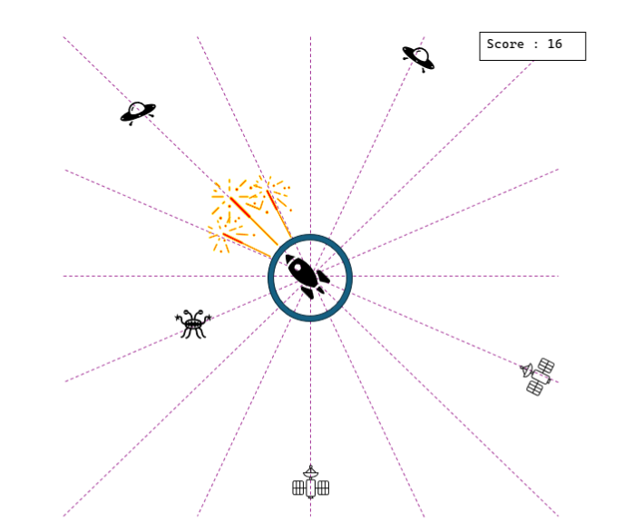

# 🚀 FPGA Implementation of Isometric Shooter Game

## Overview
Welcome to the FPGA Implementation of an Isometric Shooter Game! This project, part of the EE 314 Digital Electronics Laboratory course for Spring 2024, brings together the exciting world of game development with the technical challenges of Verilog HDL and FPGA programming. Inspired by the classic **Space Invaders**, this project provides an engaging platform to apply theoretical knowledge to real-world applications.

## Table of Contents
1. [Project Features](#project-features)
   - [Features](#features)
2. [Visuals](#visuals)
3. [Conclusion](#conclusion)

## Project Features
The project showcases a comprehensive set of features, ensuring a dynamic and enjoyable gameplay experience. Below are the details of the implemented features.

### Features
1. **Spaceship Location & Movement**
   - The spaceship is centrally located on the game field.
   - Rotates within its axis controlled by buttons on the FPGA board.
     - Button 1: Rotate clockwise by 22.5 degrees.
     - Button 2: Rotate counterclockwise by 22.5 degrees.
     - Button 3: Fire projectiles.

2. **Enemy Dynamics**
   - Enemies spawn randomly at predefined angles (0, 22.5, 45, 67.5 degrees, etc.), with 16 possible trajectories.
   - Minimum 2 enemies on the field, maximum 8.
   - Three distinct enemy types with unique health levels and shapes.
   - Enemies move radially towards the player's spaceship.

3. **Shooting Modes & Dynamics**
   - **Mode 1:** 90-degree wide spray, lower damage.
   - **Mode 2:** 45-degree narrow spray, higher damage.
   - Switch between modes using FPGA board switches.
   - Visual indicators for shooting mode and damage dealt.

4. **Player Score**
   - Score tracking and display as enemies are defeated.

5. **Game Over Condition**
   - Game ends when an enemy collides with the spaceship.
   - Displays game over message with final score.

6. **Animations**
   - Enhanced visual appeal with projectile and enemy movement animations.

7. **Background and Graphics**
   - Added background images and graphical elements.

8. **Visual Feedback**
   - Utilized LEDs and seven-segment displays for feedback.

9. **Additional Shooting Modes**
   - Explored and implemented additional shooting modes.

10. **Leveling System**
    - Changes enemy speeds and health levels over time for increased difficulty.

## Visuals

### Game Field Representation

*Figure 1: Example game field representation.*

### Shooting Mode 1

*Figure 2: Example shooting for mode 1.*

### Shooting Mode 2

*Figure 3: Example shooting for mode 2.*

## Conclusion
This project offers a robust framework for learning and applying Verilog HDL and FPGA programming within a fun and engaging game development context. By incorporating both required and bonus features, we've created a comprehensive and dynamic gameplay experience that challenges both players and developers.